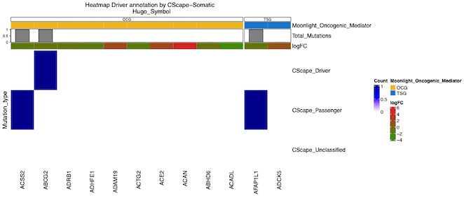
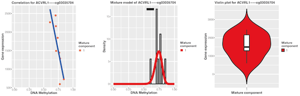

  
```{r setup, include=FALSE}
knitr::opts_chunk$set(dpi = 72)
knitr::opts_chunk$set(cache=FALSE)
```


# Abstract

In order to make light of cancer development, it is crucial to understand which genes play 
a role in the mechanisms linked to this disease and moreover which role that is. Commonly 
biological processes such as proliferation and apoptosis have been linked to cancer progression. 
We have developed the Moonlight framework that allows for prediction of cancer driver genes 
through multi-omics data integration. Based on expression data we perform functional enrichment 
analysis, infer gene regulatory networks and upstream regulator analysis to score the importance 
of well-known biological processes with respect to the studied cancer. We then use these scores 
to predict oncogenic mediators with two specific roles: genes that potentially act as tumor 
suppressor genes (TSGs) and genes that potentially act as oncogenes (OCGs). This constitutes 
Moonlight's primary layer. As gene expression data alone does not explain the cancer phenotypes, 
a second layer of evidence is needed. We have integrated two secondary layers, one based on mutations,
and one based on abnormal DNA methylation patterns, for prediction of the driver genes. 
The mutational layer predicts driver mutations in the oncogenic mediators and thereby allows 
for the prediction of cancer driver genes using the driver mutation prediction tool CScape-somatic. 
The methylation layer investigates abnormal DNA methylation patterns and differentially methylated 
CpG sites in the oncogenic mediators using the tool EpiMix and uses patterns of hypo- and 
hypermethylation for prediction of the driver genes. Overall, this methodology not only allows us 
to identify genes with dual role (TSG in one cancer type and OCG in another) but also to elucidate 
the underlying biological processes. 

# Introduction 

Cancer development is influenced by (epi)genetic alterations in two distinctly different categories of genes, 
known as  tumor suppressor genes (TSG) and oncogenes (OCG). The occurrence of these alterations in genes 
of the first category leads to faster cell proliferation while alterations in genes of second 
category increases or changes their function.
In 2020, we developed the Moonlight framework that allows for prediction of cancer driver genes 
[@ref26]. Here, gene expression data are integrated together with 
biological processes and gene regulatory networks to score the importance of well-known biological 
processes with respect to the studied cancer. These scores are used to predict oncogenic mediators: 
putative TSGs and putative OCGs. As gene expression data alone is not enough to explain the 
deregulation of the genes, a second layer of evidence is needed. For this reason, we integrated a 
secondary mutational layer which predicts driver mutations and passenger mutations 
in the oncogenic mediators. The prediction of the driver mutations are carried out using the
CScape-somatic [@ref29] driver mutation prediction tool. Those oncogenic mediators with at least one
driver mutation are retained as the final set of driver genes [@ref27]. Moreover, we have integrated 
a secondary methylation layer that investigates abnormal DNA methylation patterns in the oncogenic 
mediators using the tool EpiMix [@ref28]. Those oncogenic mediators demonstrating hypo- and hypermethylation 
patterns are predicted as OCGs and TSGs, respectively. These new functionalities are released in the 
updated version of Moonlight to produce Moonlight2R. 

# Moonlight's pipeline

Moonlight's pipeline is shown below:
```{r, fig.width=3, echo = FALSE, fig.align="center",hide=TRUE, message=FALSE,warning=FALSE}

```

# Moonlight's proposed workflow

The proposed pipeline consists of following eight steps:

1. The input to Moonlight is a set of differentially expressed genes between two biological conditions 
such as cancer and healthy samples or two cancer subtyoes. Besides differentially expressed genes,
gene expression data is also needed. Mutation data and/or methylation data are also needed. 
2. **FEA** Functional Enrichment Analysis, using Fisher's test, to identify gene sets (with biological 
functions linked to cancer) significantly enriched by regulated genes (RG).
3. **GRN** Gene Regulatory Network inferred between each single DEG (sDEG) and all genes by means of 
mutual information, obtaining for each DEG a list of RG.
4. **URA** Upstream Regulator Analysis for DEGs in each enriched gene set, we applied z-score being 
the ratio between the sum of all predicted effects for all the gene involved in the specific function 
and the square-root of the number of all genes.
5. **PRA** Pattern Recognition Analysis identifies putative TSGs (down) and OCGs (up). We either use 
user defined biological processes or random forests.
6. **DMA** Driver Mutation Analysis identifies driver mutations in the putative TSGs and OCGs through 
the driver mutation prediction tool, CScape-somatic.
7. **GMA** Gene Methylation Analysis identifies abnormal DNA methylation patterns in the putative
TSGs and OCGs through the tool, EpiMix.
8. We apply the above procedure to multiple cancer types to obtain cancer-specific lists of TSGs 
and OCGs. We compare the lists for each cancer: if a sDEG is TSG in a cancer and OCG in another we 
define it as dual-role TSG-OCG. Otherwise if we find a sDEG defined as OCG or TSG only in one tissue 
we define it as tissue specific biomarker.
9. We use the COSMIC database to define a list of gold standard TSG and OCGs to assess the accuracy 
of the proposed method.


# Installation

To install Moonlight2R use the code below.

## Installation from BioConductor

```{r, eval = FALSE}
if (!require("BiocManager", quietly = TRUE))
    install.packages("BiocManager")

BiocManager::install("Moonlight2R")
```

## Installation from GitHub

First, install `devtools` or if you already have it installed, load it.
```{r, eval = FALSE}
install.packages("devtools")
library(devtools)
```

Install Moonlight2R from GitHub:
```{r, eval = FALSE}
devtools::install_github(repo = "ELELAB/Moonlight2R")
```

## Installation from GitHub with accompanying vignette 

First, install the BiocStyle Bioconductor package.

```{r, eval = FALSE}
if (!require("BiocManager", quietly = TRUE))
    install.packages("BiocManager")

BiocManager::install("BiocStyle")
```
Then install Moonlight2R with its accompanying vignette.  

```{r, eval = FALSE}
devtools::install_github(repo = "ELELAB/Moonlight2R", build_vignettes = TRUE)
```

You can view the vignette in the following way.  

```{r, eval = FALSE}
vignette( "Moonlight2R", package="Moonlight2R")
```


# Load libraries
```{r, eval = TRUE}
library(Moonlight2R)
library(magrittr)
library(dplyr)
```


# `Obtain Input`

The input to Moonlight is a set of differentially expressed genes and gene 
expression data. Mutation and/or methylation data are also needed. These data
should be available for the same sample sets. Gene expression data, mutation 
data, methylation data and differentially expressed genes can for example be obtained from TCGA 
using the R package TCGAbiolinks. Help documents on how to use TCGAbiolinks
are available [here](https://bioconductor.org/packages/release/bioc/vignettes/TCGAbiolinks/inst/doc/index.html).
To find other examples of usage of TCGAbiolinks on TCGA cancer types see our
[GitHub repository](https://github.com/ELELAB/LUAD_LUSC_TCGA_comparison).
Example data of the input (differentially expressed genes, gene expression data, 
mutation data, and methylation data) are stored in the Moonlight2R package:

```{r, eval = TRUE}
data(DEGsmatrix)
data(dataFilt)
data(dataMAF)
data(GEO_TCGAtab)
data(LOC_transcription)
data(LOC_translation)
data(LOC_protein)
data(Oncogenic_mediators_mutation_summary)
data(DEG_Mutations_Annotations)
data(dataMethyl)
data(DEG_Methylation_Annotations)
data(Oncogenic_mediators_methylation_summary)
data(MetEvidenceDriver)
data(LUAD_sample_anno)
```


# `Download`: Get GEO data

You can search GEO data using the `getDataGEO` function.

GEO_TCGAtab: a 18x12 matrix that provides the GEO data set we matched to one of the 18 given TCGA cancer types 

```{r, eval = TRUE, echo = TRUE}
knitr::kable(GEO_TCGAtab, digits = 2,
       caption = "Table with GEO data set matched to one
       of the 18 given TCGA cancer types ",
       row.names = TRUE)
```


## `getDataGEO`: Search by cancer type and data type [Gene Expression]
The user can query and download the cancer types supported by GEO, using the function `getDataGEO`:

```{r, eval = TRUE, echo = TRUE, results='hide', warning = FALSE, message = FALSE}
dataFilt_GEO <- getDataGEO(GEOobject = "GSE20347", platform = "GPL571")
```

```{r, eval = TRUE, echo = TRUE, results='hide', warning = FALSE, message = FALSE}
dataFilt_GEO <- getDataGEO(TCGAtumor = "ESCA")
```


## `FEA`: Functional Enrichment Analysis
The user can perform a functional enrichment analysis using the function `FEA`. 
For each DEG in the gene set a z-score is calculated. This score indicates how the genes act in the gene set.

```{r, eval = TRUE, echo = TRUE, results='hide'}
data(DEGsmatrix)
data(DiseaseList)
data(EAGenes)
dataFEA <- FEA(DEGsmatrix = DEGsmatrix)
```

The output can be visualized with a FEA plot. 

## `FEAplot`: Functional Enrichment Analysis Plot
The user can plot the result of a functional enrichment analysis using the function `plotFEA`. 
A negative z-score indicates that the process' activity is decreased.  A positive z-score 
indicates that the process' activity is increased. 

```{r, eval = TRUE, echo = TRUE, message=FALSE, results='hide', warning=FALSE}
plotFEA(dataFEA = dataFEA, additionalFilename = "_exampleVignette", height = 10, width = 20)
```

The figure generated by the above code is shown below:
```{r, fig.width=3, echo = FALSE, fig.align="center",hide=TRUE, message=FALSE,warning=FALSE}

```


## `GRN`: Gene Regulatory Network
The user can perform a gene regulatory network analysis using the function
`GRN` which infers the network using the parmigene package. For illustrative
purposes and to decrease runtime, we have set `nGenesPerm = 5` and `nBoot = 5`
in the example below, however, we recommend setting these parameters to
`nGenesPerm = 2000` and `nBoot = 400` to achieve optimal results, as they are
set by default in the function arguments.

```{r, eval = TRUE}
data(DEGsmatrix)
data(dataFilt)
dataGRN <- GRN(DEGsmatrix = DEGsmatrix, TFs = sample(rownames(DEGsmatrix), 100), normCounts = dataFilt,
	               nGenesPerm = 5, kNearest = 3, nBoot = 5, DiffGenes = TRUE)
```


## `URA`: Upstream Regulator Analysis
The user can perform upstream regulator analysis using the function `URA`. This function is 
applied to each DEG in the enriched gene set and its neighbors in the GRN.

```{r, eval = TRUE, echo = TRUE, results='hide'}
data(dataGRN)
data(DEGsmatrix)
data(DiseaseList)
data(EAGenes)

dataFEA <- FEA(DEGsmatrix = DEGsmatrix)

BPselected <- dataFEA$Diseases.or.Functions.Annotation[1:5]
dataURA <- URA(dataGRN = dataGRN,
               DEGsmatrix = DEGsmatrix,
               BPname = BPselected, 
               nCores=1)
```

## `PRA`: Pattern Regognition Analysis
The user can retrieve putative TSG/OCG using either selected biological processes in
the expert-based approach or a random forest classifier trained on known COSMIC OCGs/TSGs
in the machine learning approach. The user must enter the chosen biological processes 
in the `BPname` argument to use the expert-based approach or set `BPname = NULL` to
use the machine learning approach.

```{r, eval = TRUE}
data(dataURA)
data(tabGrowBlock)
data(knownDriverGenes)
dataPRA <- PRA(dataURA = dataURA,
               BPname = c("apoptosis","proliferation of cells"),
               thres.role = 0)
```

## `DMA`: Driver Mutation Analysis
The user can identify driver mutations with `DMA` in the oncogenic mediators established by `PRA`. 
The passenger or driver status is estimated with CScape-somatic [@ref29].  
This function will further generate three files: DEG_Mutations_Annotations.rda, 
Oncogenic_mediators_mutation_summary.rda and cscape_somatic_output.rda. These will be placed 
in the specified results-folder. 
The user needs to download two CScape-somatic files in order to run DMA named css_coding.vcf.gz
and css_noncoding.vcf.gz, respectively. These two files can be downloaded at 
http://cscape-somatic.biocompute.org.uk/#download. The corresponding .tbi files (css_coding.vcf.gz.tbi
and css_noncoding.vcf.gz.tbi) must also be downloaded and be placed in the same folder.


```{r, eval = FALSE}
data(dataPRA)
data(dataMAF)
data(DEGsmatrix)
data(LOC_transcription)
data(LOC_translation)
data(LOC_protein)
data(NCG)
data(EncodePromoters)
dataDMA <- DMA(dataMAF = dataMAF,
               dataDEGs = DEGsmatrix, 
               dataPRA = dataPRA,
               results_folder = "DMAresults",
               coding_file = "css_coding.vcf.gz",
               noncoding_file = "css_noncoding.vcf.gz")
```

## `GMA`: Gene Methylation Analysis
The user can predict driver genes with `GMA` following prediction of the 
oncogenic mediators established by `PRA`. `GMA` predicts driver genes by 
investigating abnormal DNA methylation patterns in the oncogenic mediators 
using the tool EpiMix [@ref28]. Oncogenic mediators with hypo- and hypermethylation
patterns are predicted as OCGs and TSGs, respectively. This function will 
generate these files: DEG_Methylation_Annotations.rda, 
Oncogenic_mediators_methylation_summary.rda, EpiMix_Results_Enhancer.rds, 
EpiMix_Results_Regular.rds, FunctionalPairs_Enhancer.csv, FunctionalPairs_Regular.csv, 
and FunctionalProbes_Regular.rds. These will be placed in the specified results-folder. 

```{r, eval = TRUE}
data("dataMethyl")
data("dataFilt")
data("dataPRA")
data("DEGsmatrix")
data("LUAD_sample_anno")
data("NCG")
data("EncodePromoters")
data("MetEvidenceDriver")

# Subset column names (sample names) in expression data to patient level
pattern <- "^(.{4}-.{2}-.{4}-.{2}).*"
colnames(dataFilt) <- sub(pattern, "\\1", colnames(dataFilt))

dataGMA <- GMA(dataMET = dataMethyl, dataEXP = dataFilt, 
               dataPRA = dataPRA, dataDEGs = DEGsmatrix, 
               sample_info = LUAD_sample_anno, met_platform = "HM450",
               prevalence_filter = NULL,
               output_dir = "./GMAresults", cores = 1, roadmap.epigenome.ids = "E096", 
               roadmap.epigenome.groups = NULL)
```

## `GLS`: Gene Literature Search
The user can perform a literature search on driver genes  
using the `GLS` function. This function takes as input driver genes, 
a query and maximum number of records to retrieve from PubMed. 
Standard PubMed syntax can be used in the query. For example, Boolean 
operators AND, OR, NOT can be applied and tags such as [AU], 
[TITLE/ABSTRACT], [Affiliation] can be used. `GLS` fetches data of 
PubMed records matching the specified query and outputs PubMed IDs
matching the query along with doi, title, abstract, year of publication,
keywords, and total number of PubMed publications. This is done for each 
of the genes supplied in the input.

```{r, eval = TRUE}
genes_query <- "BRCA1"
dataGLS <- GLS(genes = genes_query, 
	       query_string = "AND cancer AND driver",
	       max_records = 20)
head(dataGLS)
``` 


## `Level of consequence`: Effect of mutations on three different levels
The user can investigate the predicted effect of different mutation types on the transcriptional 
level through the table LOC_transcription:

```{r}
knitr::kable(LOC_transcription)
```

The user can investigate the predicted effect of different mutation types on the translational 
level through the table LOC_translation:

```{r}
knitr::kable(LOC_translation)
```

The user can investigate the predicted effect of different mutation types on the protein level 
through the table LOC_protein:
```{r}
knitr::kable(LOC_protein)
```


## `plotNetworkHive`: GRN hive visualization taking into account COSMIC cancer genes

In the following plot the nodes are separated into three groups: known tumor suppressor genes (yellow), 
known oncogenes (green) and the rest (gray).

```{r, eval = TRUE, echo = TRUE, results='hide', warning = FALSE, message = FALSE}
data(knownDriverGenes)
data(dataGRN)
plotNetworkHive(dataGRN, knownDriverGenes, 0.55)
```


## `plotDMA`: Heatmap of the driver/passenger status of mutations in TSGs/OCGs

In the following plot the driver genes with driver mutations are shown.

```{r, eval = TRUE, warning = FALSE, message = FALSE, include=TRUE}
data(dataDMA)
data(DEG_Mutations_Annotations)
data(Oncogenic_mediators_mutation_summary)
plotDMA(DEG_Mutations_Annotations, 
        Oncogenic_mediators_mutation_summary, 
        type = 'complete', additionalFilename = "")
```


```{r, fig.width=3, fig.height=4, echo = FALSE, fig.align="center",hide=TRUE, message=FALSE,warning=FALSE}

```


## `plotMoonlight`: Heatmap of Moonlight Gene Z-scores for mutation-driven TSGs/OCGs
In the following plot the top 50 genes with the most driver mutations are visualised.
The values are the moonlight gene z-score for the two biological processes

```{r, eval = TRUE, echo = TRUE, results='hide', warning = FALSE, message = FALSE}
data(DEG_Mutations_Annotations)
data(Oncogenic_mediators_mutation_summary)
data(dataURA_plot)
plotMoonlight(DEG_Mutations_Annotations,
        Oncogenic_mediators_mutation_summary, 
        dataURA_plot, gene_type = "drivers", n = 50)
```

```{r, fig.width=3, echo = FALSE, fig.align="center",hide=TRUE, message=FALSE,warning=FALSE}

```

## `plotGMA`: Heatmap of hypo/hyper/dual methylated CpG sites in TSGs/OCGs

This function plots results of the `GMA`. It visualizes the 
number of hypo/hyper/dual methylated CpG sites in oncogenic 
mediators or in a user-supplied gene list. The results are 
visualized either in a single heatmap or split into different 
ones which is specified in the function's three modes: 
split, complete and genelist.

```{r, eval = TRUE, warning = FALSE, message = FALSE, include = TRUE}
data("DEG_Methylation_Annotations")
data("Oncogenic_mediators_methylation_summary")
genes <- c("ACAN", "ACE2", "ADAM19", "AFAP1L1")
plotGMA(DEG_Methylation_Annotations = DEG_Methylation_Annotations,
        Oncogenic_mediators_methylation_summary = Oncogenic_mediators_methylation_summary,
        type = "genelist", genelist = genes,
        additionalFilename = "./GMAresults/")
```

```{r, fig.width=3, fig.height=4, echo = FALSE, fig.align="center",hide=TRUE, message=FALSE,warning=FALSE}

```

## `plotMoonlightMet`: Heatmap of Moonlight Gene Z-scores for methylation-driven TSGs/OCGs

This function visualizes the effect of genes on biological processes
and total number of hypo/hyper/dual methylated CpG sites in genes.

```{r, eval = TRUE, warning = FALSE, message = FALSE, include = TRUE}
data("DEG_Methylation_Annotations")
data("Oncogenic_mediators_methylation_summary")
data("dataURA_plot")
genes <- c("ACAN", "ACE2", "ADAM19", "AFAP1L1")
plotMoonlightMet(DEG_Methylation_Annotations = DEG_Methylation_Annotations,
                 Oncogenic_mediators_methylation_summary = Oncogenic_mediators_methylation_summary,
                 dataURA = dataURA_plot,
                 genes = genes,
                 additionalFilename = "./GMAresults/")
```

```{r, fig.width=3, fig.height=4, echo = FALSE, fig.align="center",hide=TRUE, message=FALSE,warning=FALSE}

```

## `plotMetExp`: Visualize results from EpiMix of expression and methylation in genes 

This function visualizes results of EpiMix [@ref28] in three plots: one that
visualizes the distribution of DNA methylation data (MixtureModelPlot), one 
that visualizes gene expression levels (ViolinPlot) and one that visualizes
relationship between DNA methylation and gene expression (CorrelationPlot).

```{r, eval = TRUE, warning = FALSE, message = FALSE, include = TRUE}
data("EpiMix_Results_Regular")
data("dataMethyl")
data("dataFilt")

# Subset column names (sample names) in expression data to patient level
pattern <- "^(.{4}-.{2}-.{4}-.{2}).*"
colnames(dataFilt) <- sub(pattern, "\\1", colnames(dataFilt))

plotMetExp(EpiMix_results = EpiMix_Results_Regular,
           probe_name = "cg03035704",
           dataMET = dataMethyl,
           dataEXP = dataFilt,
           gene_of_interest = "ACVRL1",
           additionalFilename = "./GMAresults/")
```

```{r, fig.width=3, fig.height=4, echo = FALSE, fig.align="center",hide=TRUE, message=FALSE,warning=FALSE}

```


# Moonlight Analysis: Case Studies

### Introduction 
This vignette shows a complete workflow of the 'Moonlight2R' package.
The code is divided into the following case studies:

* 1. Predicting oncogenic mediators using Moonlight's primary layer 
* 2. Moonlight pipeline in one function
* 3. Moonlight with driver mutation analysis
* 4. Moonlight with gene methylation analysis

## Case study n. 1: Predicting oncogenic mediators using Moonlight's primary layer

For illustrative purposes and to decrease runtime, we have set `nGenesPerm = 5`
and `nBoot = 5` in the call of `GRN` in the following code block, however, we
recommend setting these parameters to `nGenesPerm = 2000` and `nBoot = 400` to
achieve optimal results, as they are set by default in the function arguments.

```{r,eval = TRUE,echo=TRUE,message=FALSE,warning=FALSE, results='hide'}
data(DEGsmatrix)
data(dataFilt)
data(DiseaseList)
data(EAGenes)
data(tabGrowBlock)
data(knownDriverGenes)

dataFEA <- FEA(DEGsmatrix = DEGsmatrix)

dataGRN <- GRN(TFs = sample(rownames(DEGsmatrix), 100), 
               DEGsmatrix = DEGsmatrix,
               DiffGenes = TRUE,
               normCounts = dataFilt,
               nGenesPerm = 5,
               nBoot = 5,
	       kNearest = 3)

dataURA <- URA(dataGRN = dataGRN, 
              DEGsmatrix = DEGsmatrix, 
              BPname = c("apoptosis",
                         "proliferation of cells"))

dataDual <- PRA(dataURA = dataURA, 
               BPname = c("apoptosis",
                          "proliferation of cells"),
               thres.role = 0)

oncogenic_mediators <- list("TSG"=names(dataDual$TSG), "OCG"=names(dataDual$OCG))

```


## `plotURA`: Upstream regulatory analysis plot
The user can plot the result of the upstream regulatory analysis using the function `plotURA`.

```{r, eval = TRUE,message=FALSE,warning=FALSE, results='hide'}
data(dataURA) 
plotURA(dataURA = dataURA, additionalFilename = "_exampleVignette")
```

The figure resulted from the code above is shown below:
```{r, fig.width=3, echo = FALSE, fig.align="center",hide=TRUE, message=FALSE,warning=FALSE}
knitr::include_graphics("URAplot.gif")
```


## Case study n. 2: Moonlight pipeline in one function

For illustrative purposes and to decrease runtime, we have set `nGenesPerm = 5` and `nBoot = 5`
in the following code block, however, we recommend setting these parameters to
`nGenesPerm = 2000` and `nBoot = 400` to achieve optimal results, as they are
set by default in the function arguments.

```{r,eval = FALSE,echo=TRUE,message=FALSE,warning=FALSE}
data(dataFilt)
data(DEGsmatrix)
data(dataMAF)
data(DiseaseList)
data(EAGenes)
data(tabGrowBlock)
data(knownDriverGenes)
data(LOC_transcription)
data(LOC_translation)
data(LOC_protein)
data(NCG)
data(EncodePromoters)

listMoonlight <- moonlight(dataDEGs = DEGsmatrix,
                           dataFilt = dataFilt,
                           nTF = 100,
                           DiffGenes = TRUE,
			   nGenesPerm = 5,
                           nBoot = 5,
                           BPname = c("apoptosis","proliferation of cells"),
                           dataMAF = dataMAF,
                           path_cscape_coding = "css_coding.vcf.gz", 
                           path_cscape_noncoding = "css_noncoding.vcf.gz")
save(listMoonlight, file = paste0("listMoonlight_ncancer4.Rdata"))


```

## `plotCircos`: Moonlight Circos Plot
An example of running Moonlight on five cancer types is visualized below in a circos plot.
Outer ring: color by cancer type, Inner ring: OCGs and TSGs, 
Inner connections:  green: common OCGs yellow: common TSGs red: possible dual role

```{r, eval = TRUE, echo = TRUE, results='hide', warning = FALSE, message = FALSE}
data(listMoonlight)
plotCircos(listMoonlight = listMoonlight, additionalFilename = "_ncancer5")
```

The figure generated by the code above is shown below:
```{r, fig.width=3, echo = FALSE, fig.align="center",hide=TRUE, message=FALSE,warning=FALSE}

```


## Case study n. 3: Moonlight with driver mutation analysis  

For illustrative purposes and to decrease runtime, we have set `nGenesPerm = 5` and `nBoot = 5`
in the call of `GRN` in the following code block, however, we recommend setting these parameters to
`nGenesPerm = 2000` and `nBoot = 400` to achieve optimal results, as they are
set by default in the function arguments.

```{r,eval = FALSE,echo=TRUE,message=FALSE,warning=FALSE}

data(DEGsmatrix)
data(dataFilt)
data(dataMAF)
data(DiseaseList)
data(EAGenes)
data(tabGrowBlock)
data(knownDriverGenes)
data(LOC_transcription)
data(LOC_translation)
data(LOC_protein)
data(NCG)
data(EncodePromoters)

# Perform gene regulatory network analysis
dataGRN <- GRN(TFs = rownames(DEGsmatrix), 
	       DEGsmatrix = DEGsmatrix,
	       DiffGenes = TRUE,
               normCounts = dataFilt,
               nGenesPerm = 5, 
               kNearest = 3, 
               nBoot = 5)

# Perform upstream regulatory analysis
# As example, we use apoptosis and proliferation of cells as the biological processes
dataURA <- URA(dataGRN = dataGRN,
               DEGsmatrix = DEGsmatrix,
               BPname = c("apoptosis", 
                          "proliferation of cells"), 
               nCores = 1)

# Perform pattern recognition analysis
dataPRA <- PRA(dataURA = dataURA,
               BPname = c("apoptosis", 
                          "proliferation of cells"),
               thres.role = 0)

# Perform driver mutation analysis
dataDMA <- DMA(dataMAF = dataMAF,
               dataDEGs = DEGsmatrix, 
               dataPRA = dataPRA,
               results_folder = "DMAresults",
               coding_file = "css_coding.vcf.gz",
               noncoding_file = "css_noncoding.vcf.gz")

```

Next, we analyze the predicted driver genes and their mutations. 

```{r, eval = TRUE}
data(Oncogenic_mediators_mutation_summary)
data(DEG_Mutations_Annotations)

# Extract oncogenic mediators that contain at least one driver mutation
# These are the driver genes
knitr::kable(Oncogenic_mediators_mutation_summary %>%
  filter(!is.na(CScape_Driver)))

# Extract mutation annotations of the predicted driver genes
driver_mut <- DEG_Mutations_Annotations %>% 
  filter(!is.na(Moonlight_Oncogenic_Mediator), 
         CScape_Mut_Class == "Driver")

# Extract driver genes with a predicted effect on the transcriptional level
transcription_mut <- Oncogenic_mediators_mutation_summary %>%
  filter(!is.na(CScape_Driver)) %>%
  filter(Transcription_mut_sum > 0)

# Extract mutation annotations of predicted driver genes that have a driver mutation
# in its promoter region with a potential effect on the transcriptional level 
promoters <- DEG_Mutations_Annotations %>% 
  filter(!is.na(Moonlight_Oncogenic_Mediator), 
         CScape_Mut_Class == "Driver",
         Potential_Effect_on_Transcription == 1,
         Annotation == 'Promoter')
```


## Case study n. 4: Moonlight with gene methylation analysis 

For illustrative purposes and to decrease runtime, we have set `nGenesPerm = 5` and `nBoot = 5`
in the call of `GRN` in the following code block, however, we recommend setting these parameters to
`nGenesPerm = 2000` and `nBoot = 400` to achieve optimal results, as they are
set by default in the function arguments.

```{r,eval = TRUE,echo=TRUE,message=FALSE,warning=FALSE,results='hide'}

data(DEGsmatrix)
data(dataFilt)
data(dataMAF)
data(DiseaseList)
data(EAGenes)
data(tabGrowBlock)
data(knownDriverGenes)
data(LOC_transcription)
data(LOC_translation)
data(LOC_protein)
data(NCG)
data(EncodePromoters)
data(dataMethyl)
data(LUAD_sample_anno)
data(MetEvidenceDriver)

# Perform gene regulatory network analysis
dataGRN <- GRN(TFs = rownames(DEGsmatrix), 
               DEGsmatrix = DEGsmatrix,
               DiffGenes = TRUE,
               normCounts = dataFilt,
               nGenesPerm = 5, 
               kNearest = 3, 
               nBoot = 5)

# Perform upstream regulatory analysis
# As example, we use apoptosis and proliferation of cells as the biological processes
dataURA <- URA(dataGRN = dataGRN,
               DEGsmatrix = DEGsmatrix,
               BPname = c("apoptosis", 
                          "proliferation of cells"), 
               nCores = 1)

# Perform pattern recognition analysis
dataPRA <- PRA(dataURA = dataURA,
               BPname = c("apoptosis", 
                          "proliferation of cells"),
               thres.role = 0)

# Subset column names (sample names) in expression data to patient level
pattern <- "^(.{4}-.{2}-.{4}-.{2}).*"
colnames(dataFilt) <- sub(pattern, "\\1", colnames(dataFilt))

# Perform gene methylation analysis
dataGMA <- GMA(dataMET = dataMethyl, dataEXP = dataFilt, 
               dataPRA = dataPRA, dataDEGs = DEGsmatrix, 
               sample_info = LUAD_sample_anno, met_platform = "HM450",
               prevalence_filter = NULL,
               output_dir = "./GMAresults", cores = 1, 
               roadmap.epigenome.ids = "E096", 
               roadmap.epigenome.groups = NULL)

```


## Citation

Please cite the MoonlightR and Moonlight2R packages:

* "Interpreting pathways to discover cancer driver genes with Moonlight." Nature Communications (2020): [10.1038/s41467-019-13803-0](https://doi.org/10.1038/s41467-019-13803-0). [@ref26]

* "A workflow to study mechanistic indicators for driver gene prediction with Moonlight." Briefings in Bioinformatics (2023): [10.1093/bib/bbad274](https://doi.org/10.1093/bib/bbad274). [@ref27]

Related publications to this vignette:

* "TCGAbiolinks: an R/Bioconductor package for integrative analysis of TCGA data." Nucleic acids research (2015): [gkv1507](http://dx.doi.org/doi:10.1093/nar/gkv1507). [@ref25]

* "TCGA Workflow: Analyze cancer genomics and epigenomics data using Bioconductor packages". F1000Research [10.12688/f1000research.8923.1](http://dx.doi.org/doi:10.12688/f1000research.8923.1) [@ref24]


******

Session Information
******
```{r sessionInfo}
sessionInfo()
```

# References
